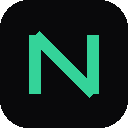

<p align="center">
  
</p>

<h1 align="center">NodeDesk</h1>

<p align="center"><strong>Your computers. One interface. Anywhere.</strong></p>

<p align="center">
  An open-source, one-click remote-computing application built around the
  <a href="https://github.com/LizardByte/Sunshine">Sunshine</a> /
  <a href="https://github.com/moonlight-stream">Moonlight</a> ecosystem.<br/>
  Use your desktops, laptops, workstations and AI machines remotely — without
  manually configuring remote-streaming infrastructure.
</p>

<p align="center">
  <code>Install → Find your computer → Connect</code>
</p>

<p align="center">
  <a href="https://berkkarabacak.github.io/nodedesk/">Website</a> ·
  <a href="docs/architecture.md">Architecture</a> ·
  <a href="docs/security.md">Security</a> ·
  <a href="CONTRIBUTING.md">Contributing</a> ·
  <a href="#roadmap">Roadmap</a>
</p>

---

## What is NodeDesk?

NodeDesk turns the (excellent, but enthusiast-oriented) Sunshine + Moonlight
streaming stack into a product anyone can use:

> **The simplicity of Parsec, powered by open-source Sunshine/Moonlight,
> designed for computers rather than gaming.**

- **One application** — host and controller in a single installer. You never
  download, install, configure or pair Sunshine and Moonlight yourself.
- **Fresh PC → working remote desktop in under 2 minutes.**
- **General-purpose**: coding, browsers, office work, creative apps, terminals,
  AI interfaces — gaming works too, but it doesn't drive the UX.
- **AI-workstation aware**: GPU/VRAM monitoring, headless virtual displays,
  and (post-MVP) discovery of local services like Ollama, Open WebUI and
  ComfyUI.
- **Secure by default**: authenticated pairing, encrypted sessions, OS secure
  credential storage, no silent public-internet exposure.

You will never need to know what a codec, port, pairing PIN, firewall rule or
virtual display is — unless you open **Advanced Settings** on purpose.

## The dashboard

```text
MY COMPUTERS

🟢 AI Workstation
RTX 3090 • 64 GB RAM • Windows
CPU 14%   GPU 72%
[ CONNECT ]

🟢 Old Laptop
Intel i7 • 16 GB • Linux
CPU 8%
[ CONNECT ]

⚫ Bedroom PC
[ WAKE ]
```

## Install

**Windows (first-class at MVP):** download `NodeDesk-Setup-x64.exe` from the
latest [release](https://github.com/berkkarabacak/nodedesk/releases) and run
it. The installer:

- installs the application and required host components
- configures the Sunshine-compatible host service automatically
- configures firewall rules and startup
- detects your GPU and supported encoders
- generates a secure device identity
- picks sensible defaults

Clean uninstall removes services, drivers, firewall rules and configuration.
Linux (AppImage/deb) and macOS (dmg) packages follow the MVP — see the
[roadmap](#roadmap).

## How it works

```text
                   NodeDesk app
                         │
             ┌───────────┴───────────┐
             │                       │
       Controller mode           Host mode
      (Moonlight technology)   (Sunshine technology)
             │                       │
             └──── Remote stream ────┘
```

NodeDesk wraps upstream Sunshine/Moonlight technology — managed, configured and
kept compatible — rather than re-implementing streaming. LAN discovery is
automatic; [Tailscale](https://tailscale.com) is a first-class *optional*
integration for reaching your machines anywhere. Details in
[docs/architecture.md](docs/architecture.md) and
[docs/networking.md](docs/networking.md).

## Security

- Authenticated pairing and certificate verification on every connection
- Encrypted streaming, file transfer and clipboard channels
- Device identity stored in OS-provided secure storage
- One-click revocation of trusted computers
- Diagnostic exports redact all secrets
- Sunshine is **never** silently exposed to the public internet

Read the full model in [docs/security.md](docs/security.md). To report a
vulnerability, see [SECURITY.md](SECURITY.md).

## Roadmap

Priorities, in order: **stability → security → simplicity → performance →
features.**

**v1.0 (Windows) ships:** one installer · host + controller in one app ·
automatic Sunshine install & configuration · Moonlight-based desktop connect ·
LAN discovery · PIN pairing without the web UI · Tailscale detection ·
computer dashboard with live CPU/RAM/GPU · clipboard sync ·
wake/sleep/restart/shutdown/lock · diagnostics · update checks.

**After v1.0:** drag & drop file transfer with resume · integrated remote
terminal · AI service discovery · automatic headless virtual displays · Linux
host · macOS controller · beta/nightly channels · hardware compatibility
matrix.

The defining test of NodeDesk:

> Can a non-technical person install this on two computers and remotely control
> one from the other without knowing what Sunshine, Moonlight, codecs, ports,
> VPNs or streaming protocols are?

If the answer is no, we keep simplifying.

## Repository layout

```text
apps/desktop/     Tauri + React desktop application (host + controller UI)
agent/            Privileged host agent (power actions, terminal, headless displays)
streaming/        Sunshine host integration & Moonlight client integration
networking/       Connection management, reconnection, Tailscale integration
discovery/        LAN + tailnet computer discovery
monitoring/       CPU/RAM/GPU/VRAM metrics, service detection
file-transfer/    Authenticated, resumable file transfer
installer/        Windows (NSIS via Tauri), Linux, macOS packaging
website/          Project website (GitHub Pages)
docs/             Architecture, security, networking, upstream, development
docs/adr/         Architecture decision records
```

## Development

See [docs/development.md](docs/development.md). Quick start:

```bash
cd apps/desktop
npm install
npm run dev        # UI in a browser (mock backend)
npm run tauri dev  # full desktop shell (requires Rust)
```

## Contributing

NodeDesk is a community open-source project. Read
[CONTRIBUTING.md](CONTRIBUTING.md), grab a
[`good first issue`](https://github.com/berkkarabacak/nodedesk/labels/good%20first%20issue),
and join the
[Discussions](https://github.com/berkkarabacak/nodedesk/discussions).

## License

GPL-3.0-only — see [LICENSE](LICENSE). NodeDesk is built on Sunshine (GPL-3.0)
and Moonlight (GPL-3.0); attribution and redistribution requirements are
documented in [THIRD_PARTY_NOTICES.md](THIRD_PARTY_NOTICES.md). NodeDesk is
not affiliated with or endorsed by LizardByte or the Moonlight project.
